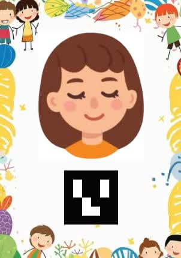
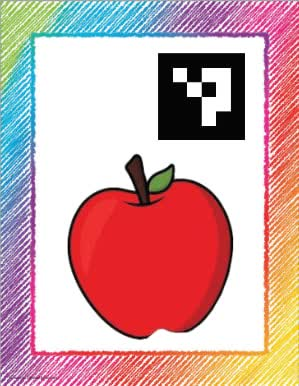
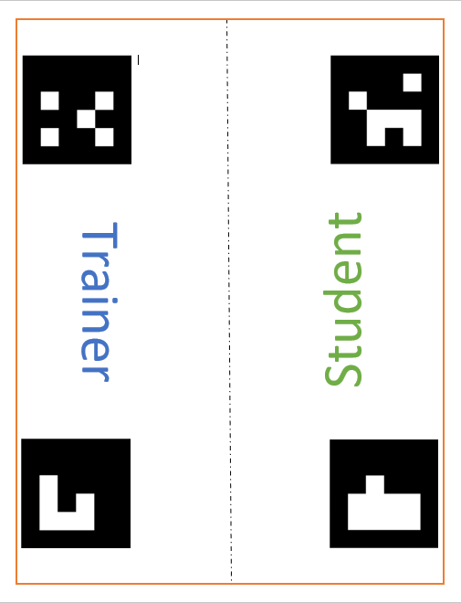

# Kiducation-With-Aruco
🎓 Marker-based interactive learning system for children, using computer vision (ArUco) and physical cards for vocabulary training – with real-time tracking and parent insights.

# ArUco Learning Game for Children 📚🎮

This is an **interactive educational game** designed for children, where **technology is used indirectly** through ArUco marker-based cards. The system promotes **face-to-face learning** while providing **telemetry and parental insight** via a messaging channel. It's fun, educational, and tech-powered without placing screens in children's hands.

---

## 📌 How It Works

- The game starts when **two children** place their **ID cards (ArUco markers)** on the play table.
- The play area is physically marked by **4 fixed ArUco markers**, dividing it into two zones:
  - 👩‍🏫 **Trainer Zone**
  - 👨‍🎓 **Student Zone**
- As the game progresses:
  - The trainer guides the student through **learning vocabulary** using word cards (also ArUco markers).
  - When a word is learned, the corresponding **word card is placed in the student zone**.
  - Each valid card placement is recorded as a learned word and counted.

---

## 🎥 Demo Video

You can watch a short demo of the system in action here:  
👉 [Click to watch the demo video](assets/demo.mp4)

<details>
  <summary>Or download and play locally</summary>

  Right-click the link above and choose "Save link as" to download.
</details>

## 🧠 What Makes It Special?

- ✅ Encourages collaborative, in-person learning  
- 🧒 No screens for kids – interaction is through physical cards  
- 💡 Real-time telemetry sent to a server (e.g., ThingsBoard)  
- 📤 Game summary is posted to an **Eitaa channel** for **parental updates**  
- 📅 Dates and times are reported in the **Persian (Jalali) calendar**  

---

## 🛠 Tech Stack

- `Python`  
- `OpenCV` + `ArUco` for marker detection  
- `Pandas` for data handling  
- `Requests` for HTTP telemetry  
- `Eitaa` bot API for parental notifications  
- `JalaliDate` for Persian date conversion  

---

## 📦 Folder Structure


<pre> ```text Kiducation-With-Aruco/ ├── src/ # Source code │ ├── main.py # Main application script │ ├── eitaa.py # Eitaa bot integration │ ├── jalaliDate.py # Utility: convert datetime to Jalali calendar │ ├── user_ids.csv # Mapping of child ID markers to names │ └── id_words.csv # Mapping of word marker IDs to actual words │ ├── assets/ # Media files for documentation │ ├── demo.mp4 # Short demo video of the system │ ├── photo18968295318.jpg # Snapshot from the game │ ├── photo18968295383.jpg # Another snapshot from the game │ └── playground.png # Layout of the interactive area │ └── README.md # Project documentation ``` </pre>

## 🖼️ Sample Cards and Game Area

Here are examples of the components used in the game:

### 👨‍🎓 Student ID Card  


---

### 🍎 Educational Word Card  


---

### 🧩 Game Board (Play Area)  

> The board is divided into **Trainer** and **Student** zones using four ArUco markers.

---

## 🔄 Telemetry Events

Three types of telemetry messages are sent:

1. **Class Start**  
2. **Each Learned Word**  
3. **Class End Summary**  

Each event includes:

- Device info (name, IP, MAC, location)  
- Trainer & student IDs  
- Timestamp (in Jalali format)  
- Learned word data (if any)  

---

## 📬 Example Notification (Eitaa Message)

📚 Class has ended!
🕒 End time: 2025-06-04 14:55:30
👩‍🏫 Trainer: Sara
👨‍🎓 Student: Reza
✅ Words learned: 5
📖 Learned words:
-apple
-orange
-banana

## 🧠 Educational Goal
This project is designed to help children learn language through physical interaction, peer teaching, and minimal reliance on screens. It promotes:

Active learning

Collaboration

Technology awareness without direct screen time

## 📌 Future Work
Multi-session tracking and analytics dashboard

Sound feedback system

Support for multiple languages

Integration with more messaging platforms

## 🤝 Contributing
Feel free to fork the project and submit pull requests. Any ideas to improve the game or extend the learning method are warmly welcome!